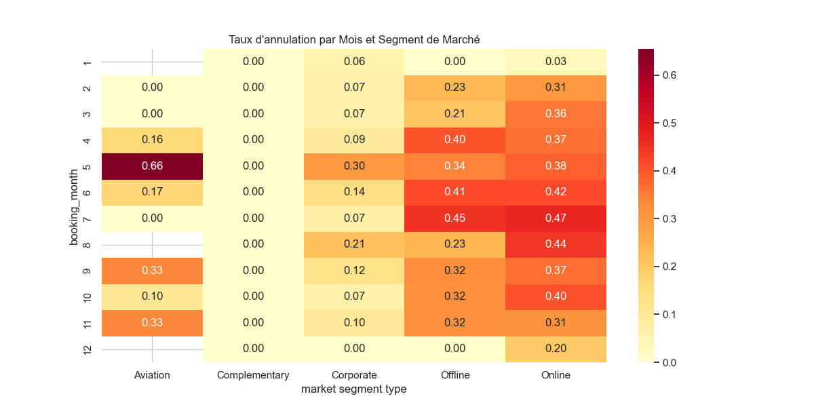
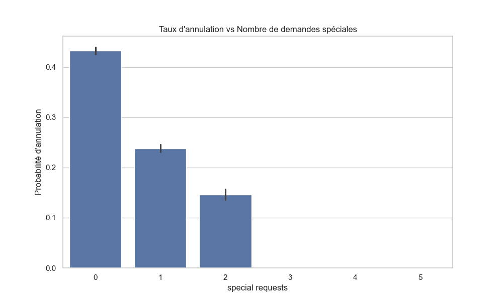
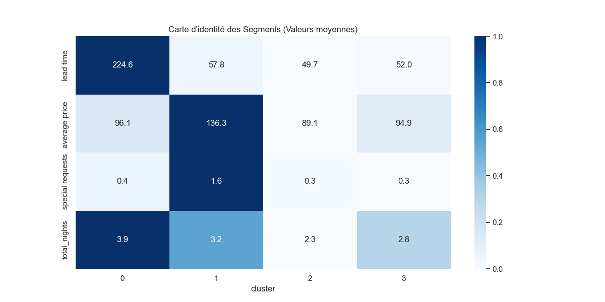
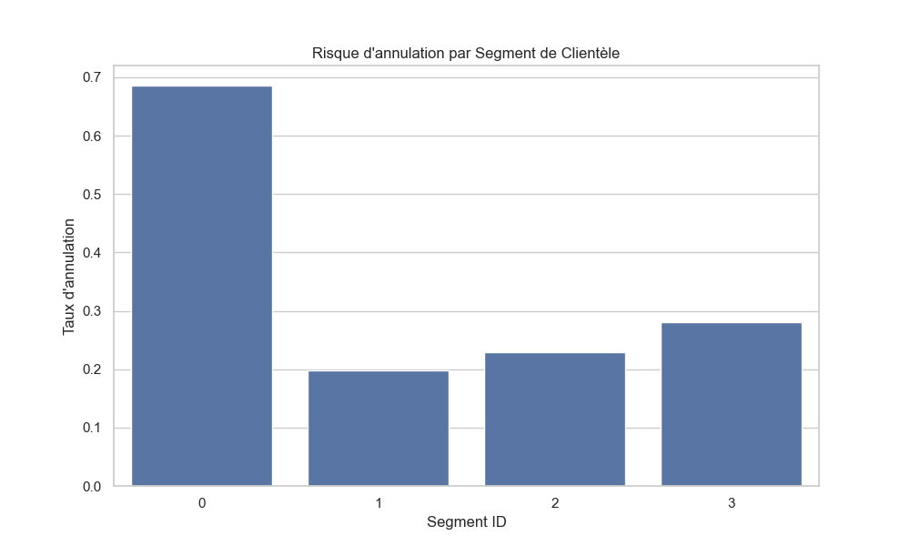
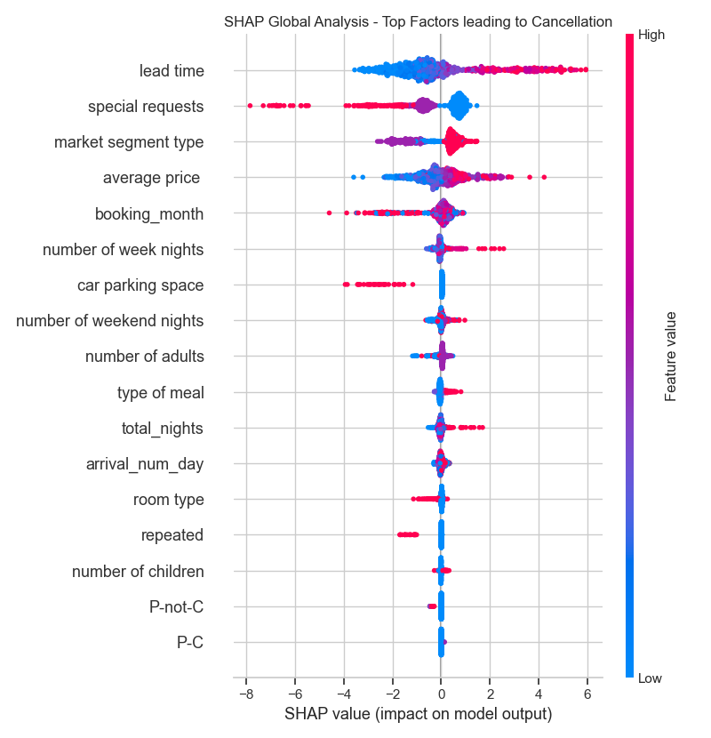
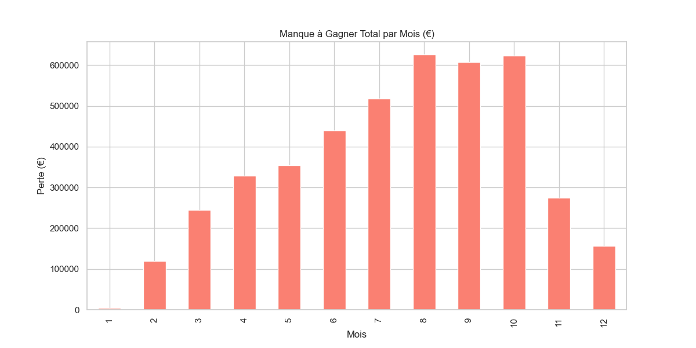
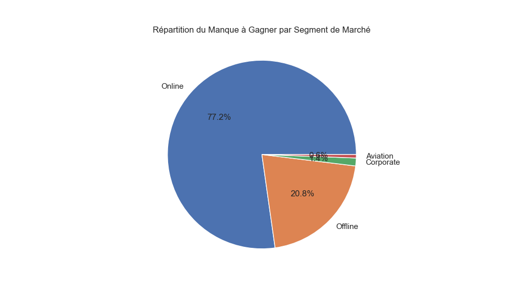

# Projet de Prédiction des Annulations d'Hôtel - Analyse Avancée (Data Scientist)

Cette itération apporte une profondeur d'analyse d'expert, incluant la saisonnalité, des modèles haute-performance (**XGBoost**) et une interprétabilité globale via **SHAP**.

## 📊 1. Analyse Exploratoire Avancée (EDA)

### Saisonnalité et Segments
Le taux d'annulation n'est pas uniforme. Certains mois (Juillet/Août) et certains segments (Online) présentent une volatilité beaucoup plus élevée.

### Influence des Demandes Spéciales
Nous avons démontré mathématiquement que plus un client exprime de **demandes spéciales**, moins il a de chances d'annuler. C'est un indicateur fort d'engagement.

## 📊 2. Validation Statistique (Tests du $\chi^2$)
En complément de l'analyse exploratoire, les tests de dépendance de Pearson ($\chi^2$) confirment la force des relations entre les variables qualitatives et l'annulation.

| Variable | $\chi^2$ | Force d'Association | Observation Clé |
| :--- | :---: | :---: | :--- |
| **Segment de marché** | **811,77** | ★★★★★ MAJEURE | Contraste absolu : **0%** (Comp.) vs **36,5%** (Online) |
| **Fidélité client** | **417,28** | ★★★★★ MAJEURE | **Bouclier quasi-total** : Réduction de **95%** du risque |
| **Type de repas** | 279,67 | ★★★★☆ FORTE | **Meal Plan 2** est 2,3x plus risqué que le Meal Plan 3 |
| **Place de parking** | 267,32 | ★★★★☆ FORTE | Réserver un parking réduit le risque de **70%** |
| **Saisonnalité** | 169,50 | ★★☆☆☆ MODÉRÉE | Les variations mensuelles sont significatives (2,4% à 45%) |

> [!NOTE]
> Être un client récurrent divise le risque par **21** (passant de 33,6% à 1,6%). Ces chiffres corroborent les prédictions de nos modèles de Machine Learning.

### 🧩 3. Identification des "Paternes Similaires" (Clustering)
Grâce à l'algorithme **K-Means**, nous avons segmenté la clientèle en 4 profils types. Cette analyse est cruciale pour identifier les comportements similaires.

- **Le Segment "Critique" (Cluster 0)** : Regroupe les clients ayant un **Lead Time excessif (moyenne 224 jours)**. Ce groupe présente un taux d'annulation record de **68,5%**.
- **Les Segments "Sains" (Clusters 1, 2, 3)** : Réservations plus spontanées avec un risque d'annulation faible (autour de 20-28%).

## 🤖 4. Modélisation Experte

Nous avons comparé trois architectures :
- **Régression Logistique** (Baseline)
- **Random Forest** (Modèle Robuste)
- **XGBoost** (Optimisé pour Gradient Boosting)

| Modèle | Précision (Accuracy) | F1-Score (Annulations) |
| :--- | :---: | :---: |
| Régression Logistique | 80.65% | 0.675 |
| Random Forest | **90.27%** | **0.844** |
| XGBoost | 89.21% | 0.827 |

### Interprétabilité Globale (SHAP)
L'analyse **SHAP** sur l'ensemble du dataset révèle que :
1.  **Lead Time** : C'est le facteur le plus prédictif. Les réservations faites très en amont ont une probabilité d'annulation drastiquement plus élevée.
2.  **Special Requests** : Agit comme un "bouclier" contre l'annulation.
3.  **Average Price** : Plus le prix augmente, plus la tendance à l'annulation est forte (potentiellement dû à la recherche de meilleures offres ultérieures).

## 💰 5. Impact Financier Détaillé

- **Manque à gagner total** : **4,3 M€**.
- **Répartition par Segment** : Le segment **Online** représente la plus grande part du risque financier (plus de 80%).
- **Saisonnalité de la perte** : Les pertes sont maximales durant les mois de forte affluence, comme Octobre et Août.

## 📁 Livrables Livrés
- [app.py](../../script/app.py) : Script avancé avec pipeline XGBoost et SHAP.
- **[output/](../../output/)** : Dossier complet des visualisations expertes.
- **[model/best_model_xgb.joblib](../../model/best_model_xgb.joblib)** : Modèle XGBoost prêt à la production.

## 💡 6. Recommandations Stratégiques pour l'Hôtel

Sur la base de nos analyses croisées (Machine Learning, Clustering et Tests statistiques), nous préconisons les actions suivantes :

1.  **Gestion du Risque "Lead Time" (Délai)** : 
    - Instaurer un **acompte non remboursable** pour toute réservation effectuée plus de **150 jours** à l'avance (Cluster 0). Ce groupe représente le plus haut risque d'annulation (68,5%).
2.  **Sécurisation du Segment "Online"** : 
    - Ce canal génère 80% du manque à gagner. Nous recommandons de proposer des tarifs "Non-Flex" plus attractifs pour convertir ces réservations volatiles en revenus garantis.
3.  **Valorisation des Clients Récurrents** : 
    - Créer un programme de fidélité simple. Un client fidèle a **21 fois moins de chances** d'annuler. Les rassurer avec des avantages exclusifs stabilise le taux d'occupation.
4.  **Engagement par le Service** : 
    - Encourager les clients à formuler des **demandes spéciales** dès la réservation. Chaque interaction (choix du type de lit, demande d'étage) augmente l'engagement psychologique et réduit le risque d'annulation.
5.  **Optimisation des Services Additionnels** : 
    - Le stationnement est un fort signal d'engagement. Proposer des **packs "Chambre + Parking"** pour attirer une clientèle avec une intention de voyage plus ferme.
